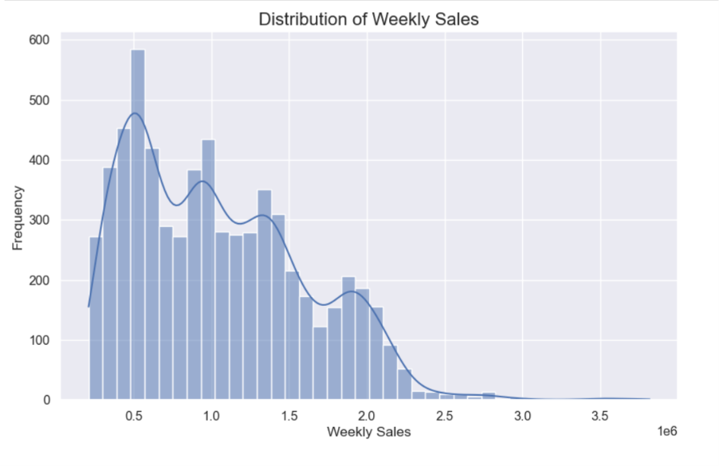
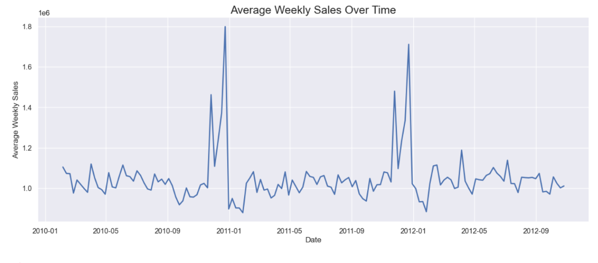
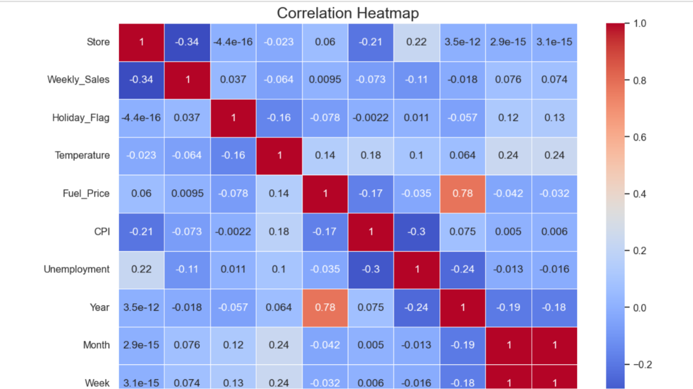
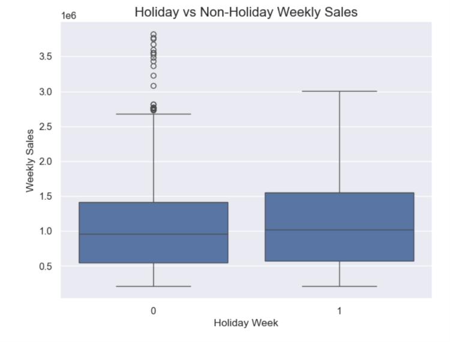
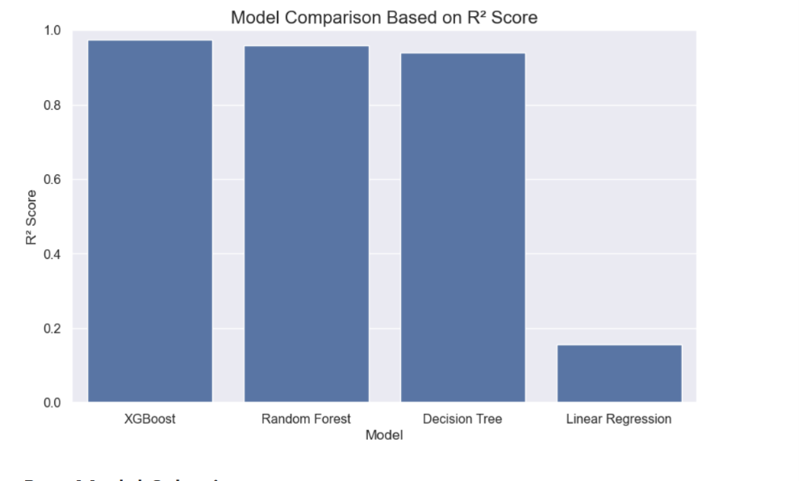
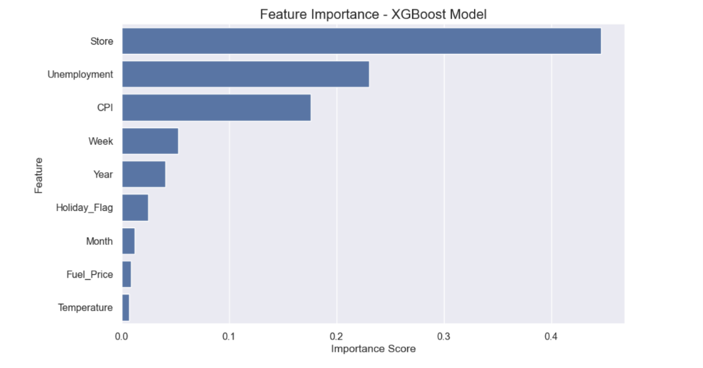

# 📈 Retail Sales Forecasting using XGBoost


---

# 📌 Project Overview

Retail sales forecasting helps businesses predict future sales, optimize inventory, improve demand planning, and make data-driven decisions.

This project builds and evaluates multiple machine learning models to predict Walmart's weekly sales using historical sales and economic indicators. After comparing different algorithms, **XGBoost** achieved the highest prediction performance and was selected as the final model.

---

# 🎯 Objectives

- Predict weekly retail sales
- Analyze factors affecting sales
- Compare multiple machine learning models
- Identify the best-performing model
- Interpret feature importance

---

# 📂 Dataset

The dataset contains historical Walmart sales records with the following features:

| Feature | Description |
|----------|-------------|
| Store | Store Number |
| Date | Weekly Date |
| Weekly_Sales | Target Variable |
| Holiday_Flag | Holiday Indicator |
| Temperature | Weekly Temperature |
| Fuel_Price | Fuel Price |
| CPI | Consumer Price Index |
| Unemployment | Unemployment Rate |

---

# 🛠️ Technologies Used

- Python
- Pandas
- NumPy
- Matplotlib
- Seaborn
- Scikit-Learn
- XGBoost
- Joblib
- Jupyter Notebook

---

# 📊 Exploratory Data Analysis

Several visualizations were created to understand sales patterns and feature relationships.

## Weekly Sales Distribution



---

## Average Weekly Sales Over Time



---

## Correlation Heatmap



---

## Holiday vs Non-Holiday Sales



---

# 🤖 Machine Learning Models

The following regression models were trained and evaluated:

- Linear Regression
- Decision Tree Regressor
- Random Forest Regressor
- XGBoost Regressor

---

# 📈 Model Comparison



After comparing all models, **XGBoost** produced the highest R² Score and was selected as the final forecasting model.

---

# ⭐ Feature Importance



The model indicates that **Store**, **Unemployment**, and **CPI** were among the most influential features affecting weekly sales predictions.

---

# 📁 Project Structure

```
retail-sales-forecasting-xgboost/
│
├── data/
│   └── Walmart.csv
│
├── notebook/
│   └── walmart_sales_forecasting.ipynb
│
├── model/
│   └── xgboost_sales_forecasting_model.pkl
│
├── images/
│
├── requirements.txt
├── README.md
├── LICENSE
└── .gitignore
```

---

# ⚙️ Installation

Clone the repository

```bash
git clone https://github.com/yourusername/retail-sales-forecasting-xgboost.git
```

Install dependencies

```bash
pip install -r requirements.txt
```

Launch Jupyter Notebook

```bash
jupyter notebook
```

---

# 🚀 How to Run

1. Clone the repository.
2. Install the required libraries.
3. Open the notebook.
4. Run all cells.
5. View the generated predictions and visualizations.

---

# 📌 Future Improvements

- Hyperparameter Optimization
- Cross Validation
- Time-Series Forecasting Models
- Deployment using Streamlit
- Real-time Sales Prediction API

---

# 👨‍💻 Author

**Mohammed Faizuddin**

AI & Data Science Student

---

## ⭐ If you found this project helpful, consider giving it a star!