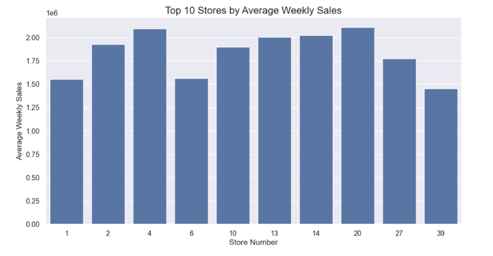
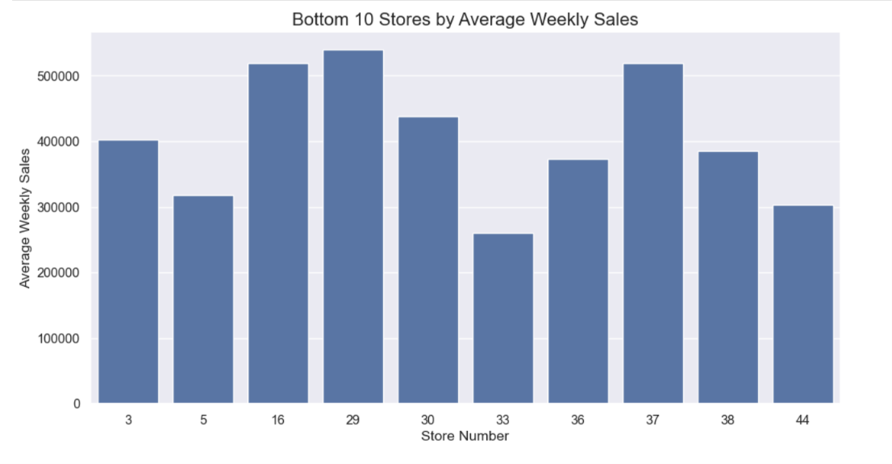
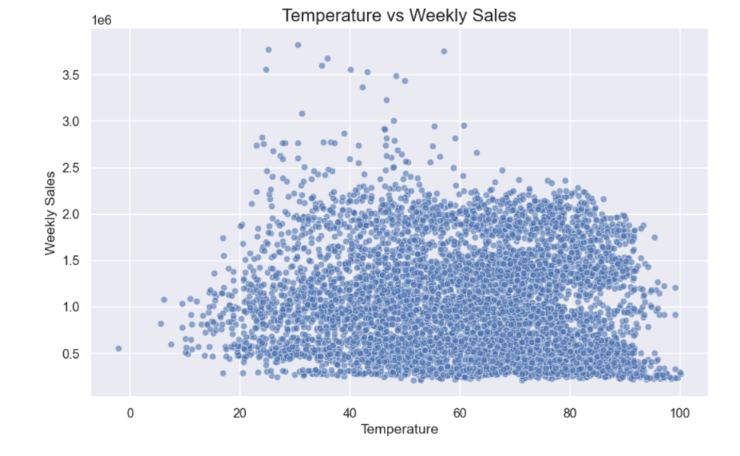
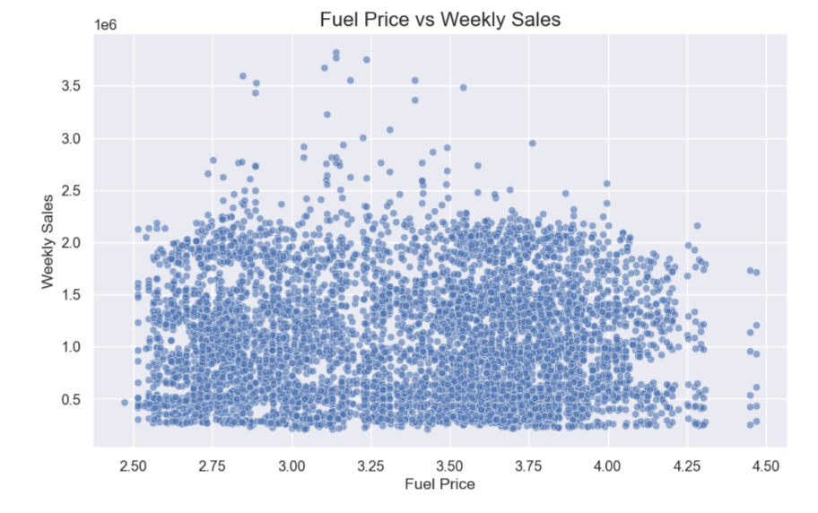

# 📈 Retail Sales Forecasting using XGBoost


---

# 📌 Project Overview

Retail sales forecasting enables businesses to estimate future sales, optimize inventory management, improve demand planning, and support data-driven business decisions.

This project develops and compares multiple machine learning regression models to predict Walmart's weekly sales using historical sales records and economic indicators. After evaluating multiple algorithms, **XGBoost achieved the best overall performance** and was selected as the final forecasting model.

### 💼 Business Impact

This project demonstrates how machine learning can improve retail demand forecasting by helping businesses:

- Optimize inventory management
- Reduce stock shortages
- Reduce overstocking
- Improve demand planning
- Support data-driven business decisions

---

# 🚀 Project Highlights

- End-to-end Machine Learning workflow
- Data preprocessing
- Feature engineering
- Exploratory Data Analysis (EDA)
- Multiple regression model comparison
- XGBoost model training
- Feature importance interpretation
- Model serialization using Pickle

---

# 🎯 Objectives

- Predict Walmart weekly sales accurately
- Analyze factors influencing sales
- Perform Exploratory Data Analysis (EDA)
- Compare multiple machine learning models
- Identify the best-performing model
- Interpret feature importance

---

# 📂 Dataset

The dataset contains historical Walmart weekly sales records.

| Feature | Description |
|----------|-------------|
| Store | Store Number |
| Date | Weekly Sales Date |
| Weekly_Sales | Target Variable |
| Holiday_Flag | Holiday Indicator |
| Temperature | Average Temperature |
| Fuel_Price | Fuel Price |
| CPI | Consumer Price Index |
| Unemployment | Unemployment Rate |

---

# 🛠 Technologies Used

- Python
- Pandas
- NumPy
- Matplotlib
- Seaborn
- Scikit-Learn
- XGBoost
- Pickle
- Jupyter Notebook

---

# 📊 Exploratory Data Analysis

Several visualizations were created to understand sales trends and relationships between variables.

## Weekly Sales Distribution


---

## Average Weekly Sales Over Time


---

## Correlation Heatmap


---

## Holiday vs Non-Holiday Sales


---

## Top 10 Stores by Average Weekly Sales



---

## Bottom 10 Stores by Average Weekly Sales



---

## Temperature vs Weekly Sales



---

## Fuel Price vs Weekly Sales



---

# 🤖 Machine Learning Models

The following regression models were trained and evaluated.

- Linear Regression
- Decision Tree Regressor
- Random Forest Regressor
- XGBoost Regressor

Among all the evaluated models, **XGBoost achieved the highest prediction accuracy**, making it the final forecasting model.

---

# 📈 Model Performance

The models were evaluated using three regression metrics.

## Evaluation Metrics

- R² Score
- Mean Absolute Error (MAE)
- Root Mean Squared Error (RMSE)

| Model | MAE | RMSE | R² Score |
|--------|------------:|------------:|---------:|
| **XGBoost** | **50,694.27** | **91,622.66** | **0.9739** |
| Random Forest | 61,790.53 | 113,073.45 | 0.9603 |
| Decision Tree | 77,073.58 | 139,919.61 | 0.9392 |
| Linear Regression | 432,594.98 | 521,583.50 | 0.1555 |

### Key Findings

- XGBoost achieved the highest R² Score (**97.39%**).
- It produced the lowest MAE and RMSE.
- XGBoost was selected as the final forecasting model.

---

# ⭐ Feature Importance


The trained XGBoost model identified the following features as the most influential.

- Store
- Unemployment
- CPI
- Week

These variables contributed the most toward accurately predicting Walmart's weekly sales.

---

# 📁 Project Structure

```text
walmart-retail-sales-forecasting-xgboost/
│
├── data/
│   └── Walmart.csv
│
├── notebook/
│   └── walmart_sales_forecasting.ipynb
│
├── model/
│   └── xgboost_sales_forecasting_model.pkl
│
├── images/
│
├── README.md
├── requirements.txt
├── LICENSE
└── .gitignore
```---

# ⚙️ Installation

Clone the repository:

```bash
git clone https://github.com/MdFaizu-coder/walmart-retail-sales-forecasting-xgboost.git
```

Navigate to the project directory:

```bash
cd walmart-retail-sales-forecasting-xgboost
```

Install all required dependencies:

```bash
pip install -r requirements.txt
```

Launch Jupyter Notebook:

```bash
jupyter notebook
```

---

# 🚀 How to Run

1. Clone this repository.
2. Install all required dependencies.
3. Open the notebook:

```text
notebook/walmart_sales_forecasting.ipynb
```

4. Run all notebook cells sequentially.

The notebook will automatically:

- Load the Walmart dataset
- Perform data preprocessing
- Conduct Exploratory Data Analysis (EDA)
- Train multiple regression models
- Compare model performance
- Evaluate models using MAE, RMSE, and R² Score
- Display feature importance
- Save the trained XGBoost model using Pickle

---

# 📌 Future Improvements

- Hyperparameter tuning using GridSearchCV
- Cross-validation for improved model generalization
- Time-series forecasting using Prophet or LSTM
- Deploy the model using Streamlit
- Build a REST API using FastAPI
- Develop a real-time sales prediction dashboard
- Automate model retraining for new data

---

# 🎯 Learning Outcomes

Through this project, I gained practical experience in:

- Data preprocessing and cleaning
- Feature engineering
- Exploratory Data Analysis (EDA)
- Regression algorithms
- Model evaluation and comparison
- Feature importance analysis
- Model serialization using Pickle
- End-to-end Machine Learning workflow

---

# 👨‍💻 Author

## Mohammed Faizuddin

AI & Data Science Student

### Connect with me

[](https://github.com/MdFaizu-coder)

[](https://www.linkedin.com/in/mohammed-faizuddin-36815730b/)

---

# 📜 License

This project is licensed under the **MIT License**.

Feel free to use, modify, and distribute this project in accordance with the license terms.

For more details, refer to the `LICENSE` file.

---

# ⭐ Support

If you found this project helpful, please consider giving it a ⭐ on GitHub.

Your support helps others discover the project and motivates me to build more Machine Learning and AI projects.

---

## 🙌 Thank You

Thank you for visiting this repository!

If you have any suggestions, feedback, or collaboration ideas, feel free to connect with me.

Happy Coding! 🚀